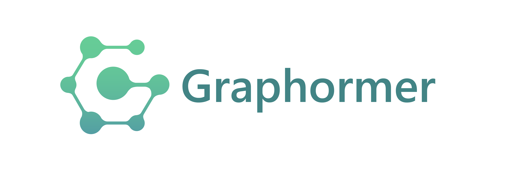

 

Graphormer is a deep learning package that allows researchers and developers to train custom models for molecule modeling tasks. It aims to accelerate the research and application in AI for molecule science, such as material discovery, drug discovery, etc. [Project website](https://www.microsoft.com/en-us/research/project/graphormer/).

## Highlights in Graphormer v2.0
* The model, code, and script used in the [Open Catalyst Challenge](https://opencatalystproject.org/challenge.html) are available.
* Pre-trained models on PCQM4M and PCQM4Mv2 are available, more pre-trained models are comming soon.
* Supports interface and datasets of PyG, DGL, OGB, and OCP.
* Supports fairseq backbone.
* Document is online!

## What's New:

***03/10/2022***
  1. We upload a [technical report](https://arxiv.org/abs/2203.04810) which describes improved benchmarks on PCQM4M & Open Catalyst Project.

***12/22/2021***
  1. Graphormer v2.0 is released. Enjoy!

***12/10/2021***
  1. **Graphormer** has won the [Open Catalyst Challenge](https://opencatalystproject.org/challenge.html). The technical talk could be found through this [link](https://www.youtube.com/watch?v=uKJX3Mpu3OA&ab_channel=OpenCatalystProject).
  2. The **slides** of NeurIPS 2021 could be found through this [link](https://neurips.cc/media/neurips-2021/Slides/27679_XmkCZkZ.pdf).
  3. The **new release** of Graphormer is comming soon, as a general molecule modeling toolkit, with models used in OC dataset, completed pre-trained model zoo, flexible data interface, and higher effiency of training.

***09/30/2021***
  1. **Graphormer** has been accepted by **NeurIPS 2021**.
  2. We're hiring! Please contact ``shuz[at]microsoft.com`` for more information.

***08/03/2021***
  1. Codes and scripts are released.
  
***06/16/2021***
  1. Graphormer has won the **1st place** of quantum prediction track of Open Graph Benchmark Large-Scale Challenge (KDD CUP 2021) [[Competition Description]](https://ogb.stanford.edu/kddcup2021/pcqm4m/) [[Competition Result]](https://ogb.stanford.edu/kddcup2021/results/) [[Technical Report]](https://arxiv.org/pdf/2106.08279.pdf)   [[Blog (English)]](https://www.microsoft.com/en-us/research/lab/microsoft-research-asia/articles/transformer-stands-out-as-the-best-graph-learner-researchers-from-microsoft-research-asia-wins-the-kdd-cups-2021-graph-prediction-track/) [[Blog (Chinese)]](https://www.msra.cn/zh-cn/news/features/ogb-lsc) 


## Get Started

Our primary documentation is at https://graphormer.readthedocs.io/ and is generated from this repository, which contains instructions for getting started, training new models and extending Graphormer with new model types and tasks.

Next you may want to read:

* [Examples](https://github.com/microsoft/Graphormer/tree/main/examples) showing command line usage of common tasks.


## Requirements and Installation

#### Setup with Conda

```
bash install.sh
```

#### Setup with NVIDIA PyTorch Container
```shell
# NVIDIA PyTorch Container
docker pull nvcr.io/nvidia/pytorch:23.05-py3
docker run -itd --name sx_fairseq_ngc nvcr.io/nvidia/pytorch:23.05-py3 bash  # 23.03-py3为python3.8容器
docker exec -ti sx_fairseq_ngc bash

pip install lmdb==1.4.1
pip install torch_scatter==2.1.1
pip install torch_sparse==0.6.17
pip install torch_geometric==2.3.1
pip install tensorboardX==2.5.1
pip install ogb==1.3.6
pip install rdkit_pypi==2022.9.5
pip install dgl==1.1.2

cd /path/to/workspace

git clone https://github.com/microsoft/Graphormer.git
cd Graphormer/fairseq
git submodule update --init --recursive

pip install --upgrade setuptools wheel
python -m pip install pip==21.1
pip install --editable ./ --no-deps --use-feature=in-tree-build
python setup.py build_ext --inplace
pip install setuptools==59.5.0
pip install omegaconf==2.0.6
pip install hydra-core==1.0.7
pip install sacrebleu==2.3.1
pip install bitarray==2.8.1
```

## Citation
Please kindly cite this paper if you use the code:
```
@article{shi2022benchmarking,
  title={Benchmarking Graphormer on Large-Scale Molecular Modeling Datasets},
  author={Yu Shi and Shuxin Zheng and Guolin Ke and Yifei Shen and Jiacheng You and Jiyan He and Shengjie Luo and Chang Liu and Di He and Tie-Yan Liu},
  journal={arXiv preprint arXiv:2203.04810},
  year={2022},
  url={https://arxiv.org/abs/2203.04810}
}

@inproceedings{
ying2021do,
title={Do Transformers Really Perform Badly for Graph Representation?},
author={Chengxuan Ying and Tianle Cai and Shengjie Luo and Shuxin Zheng and Guolin Ke and Di He and Yanming Shen and Tie-Yan Liu},
booktitle={Thirty-Fifth Conference on Neural Information Processing Systems},
year={2021},
url={https://openreview.net/forum?id=OeWooOxFwDa}
}
```

## Contributing

This project welcomes contributions and suggestions.  Most contributions require you to agree to a
Contributor License Agreement (CLA) declaring that you have the right to, and actually do, grant us
the rights to use your contribution. For details, visit https://cla.opensource.microsoft.com.

When you submit a pull request, a CLA bot will automatically determine whether you need to provide
a CLA and decorate the PR appropriately (e.g., status check, comment). Simply follow the instructions
provided by the bot. You will only need to do this once across all repos using our CLA.

This project has adopted the [Microsoft Open Source Code of Conduct](https://opensource.microsoft.com/codeofconduct/).
For more information see the [Code of Conduct FAQ](https://opensource.microsoft.com/codeofconduct/faq/) or
contact [opencode@microsoft.com](mailto:opencode@microsoft.com) with any additional questions or comments.

## Trademarks

This project may contain trademarks or logos for projects, products, or services. Authorized use of Microsoft 
trademarks or logos is subject to and must follow 
[Microsoft's Trademark & Brand Guidelines](https://www.microsoft.com/en-us/legal/intellectualproperty/trademarks/usage/general).
Use of Microsoft trademarks or logos in modified versions of this project must not cause confusion or imply Microsoft sponsorship.
Any use of third-party trademarks or logos are subject to those third-party's policies.
